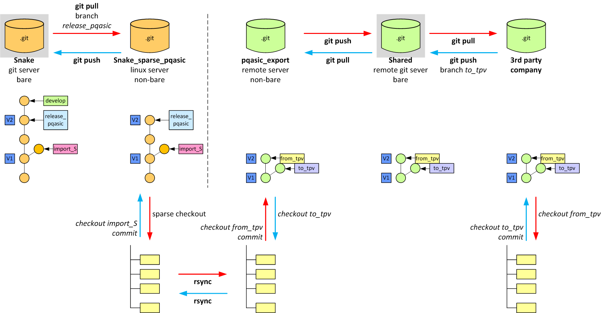

Sharing source code with an external company
============================================

System
------

Setup
-----

[source, bash]
----------------------------------------------
include::../setup_sparse.sh[]
----------------------------------------------

[source, bash]
----------------------------------------------
include::../setup_export.sh[]
----------------------------------------------

Synchronizing all repositories upon changes
-------------------------------------------

[source, bah]
----------------------------------------------
include::../sync_repos.sh[]
----------------------------------------------

Todo
----
* copying the tag !
* push back from external --> on separate import branch !!

